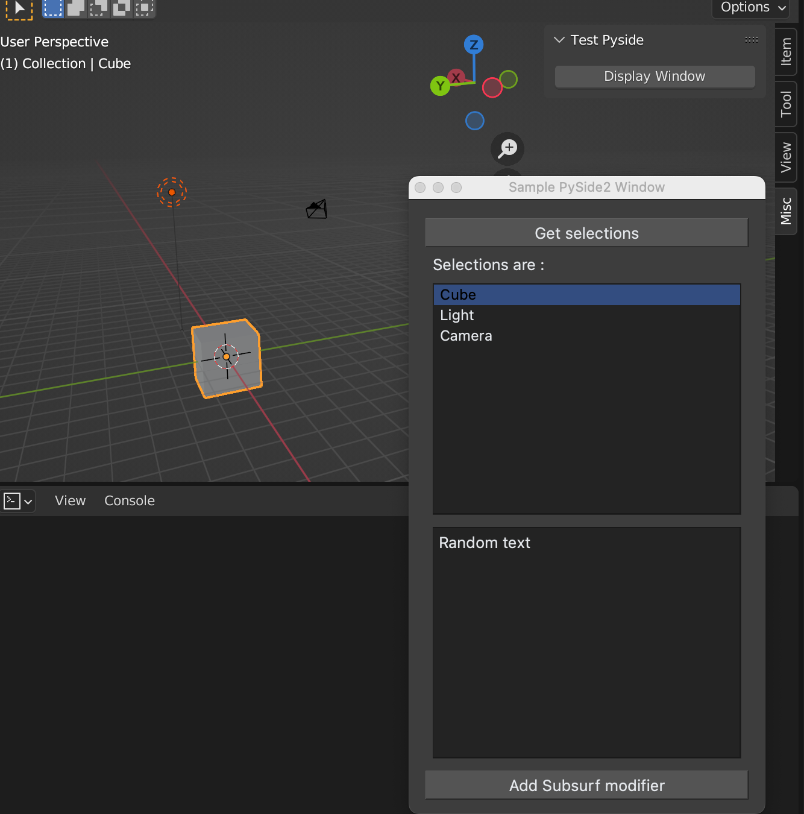

# Blender/PySide2 sample window

A tiny template script for PySide window in Blender

For more advanced setup, you may take a look [blender_pyside2_example](https://github.com/friedererdmann/blender_pyside2_example) by friedererdmann

## Requirements
* PySide2

## Install
Copy download the repsoitory to Blender addon directory (eg. in mac, /Users/USER/Library/Application Support/Blender/3.2/scripts/addons)

This is not addon (for now). So create a new text in the Scripting tab and run the following command. 

```python
from bpyside import main
main.register()
```




## Code used in this repository
* [blender_pyside2_example](https://github.com/friedererdmann/blender_pyside2_example) : Apache-2.0 License <br>
    © friedererdmann <br>
* https://blenderartists.org/t/parent-pyqt-window-widget-to-blenders-window/700722 <br>
    © pistiwique <br>
